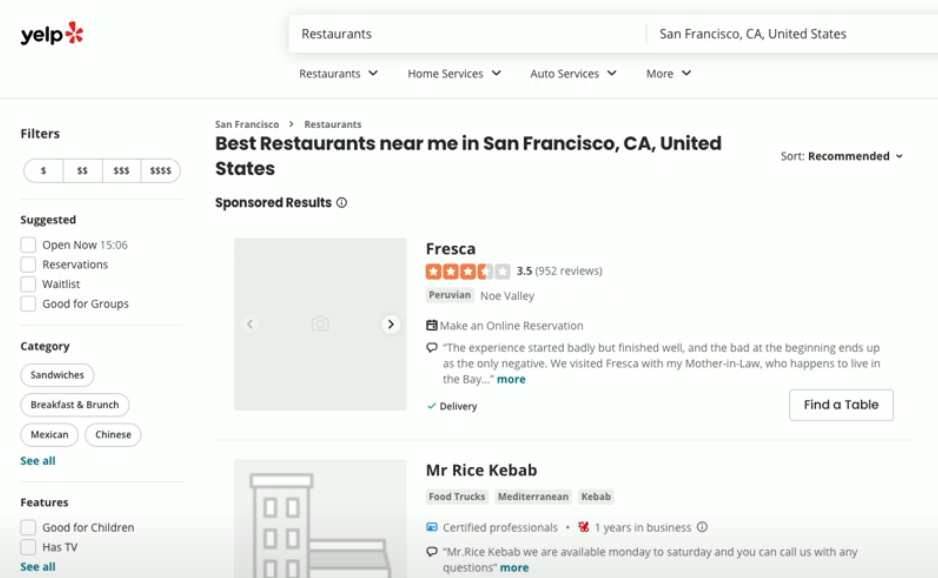

# Web Scraping

Some websites don't have lovely APIs for us to interface with.

If we want data from these pages, we have to use a tecnique called **scraping**. This means downloading the whole webpage and poking at it until we can find the information we want.

You're going to use scraping to get the top ten restaurants near you.
## Get started
👉 Go to a website like Yelp and search for the top 10 reastaurants in your location. Copy the URL.



Assign the url into a variable in your repl ()
```python
url = "https://www.yelp.co.uk/search?find_desc=Restaurants&find_loc=San+Francisco%2C+CA%2C+United+States"
```
## Import libraries
👉 Import your libraries. Beautiful soup is a specialist library for extracting the contents of HTML and helping us parse them. **Run the Repl** once your imports are sorted because we want the Beautiful Soup library to be installed (it'll run quicker this way).

```python
import requests
from bs4 import BeautifulSoup

url = "https://www.yelp.co.uk/search?find_desc=Restaurants&find_loc=San+Francisco%2C+CA%2C+United+States"
```
## Webpage as text
👉  Use `requests` to get the webpage as text.  When printing the html, we get back just how much info there is contained in the page.

```python
import requests
from bs4 import BeautifulSoup

url = "https://www.yelp.co.uk/search?find_desc=Restaurants&find_loc=San+Francisco%2C+CA%2C+United+States"

response = requests.get(url)
html = response.text

print(html)
```


## Copy this code and see if you can download the web page you are viewing.