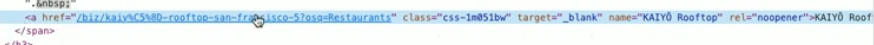

# More Scraping

👉 Next, we pass the html to Beautiful Soup to make more sense of it. 
- `html.parser` will scan through the HTML recognizing tokens in the text and breaking it down into something more meaningful.


```python
import requests
from bs4 import BeautifulSoup

url = "https://www.yelp.co.uk/search?find_desc=Restaurants&find_loc=San+Francisco%2C+CA%2C+United+States"

response = requests.get(url)
html = response.text

soup = BeautifulSoup(html, 'html.parser')
```
## Inspect
👉 Back on Yelp, right click the first (non-sponsored) restaurant on the list and **inspect it**.  

Right click and **copy element** for the whole URL, then paste it into your repl as a temporary measure.



```python
import requests
from bs4 import BeautifulSoup

url = "https://www.yelp.co.uk/search?find_desc=Restaurants&find_loc=San+Francisco%2C+CA%2C+United+States"

response = requests.get(url)
html = response.text

soup = BeautifulSoup(html, 'html.parser')

<a href="/biz/marufuku-ramen-san-francisco-5?osq=Restaurants" class="css-1m051bw" target="_blank" name="Marufuku Ramen" rel="noopener">Marufuku Ramen</a>
```
Inspecting the link gives us clues about what we want beautiful soup to look for. In this case, I want it to look for `<a>` tags and the class `css-1m051bw`.

## Store results
👉 I've created a new variable to store the result of the beautiful soup search.

- `find_all` takes two arguments. The first is the `a` tag. The second is a dictionary that tells it what class to search for. This effectively says '_find me all the a tags with this class in them_.'
- I've printed the `len` of those results to see how many I get back.

```python
import requests
from bs4 import BeautifulSoup

url = "https://www.yelp.co.uk/search?find_desc=Restaurants&find_loc=San+Francisco%2C+CA%2C+United+States"

response = requests.get(url)
html = response.text

soup = BeautifulSoup(html, 'html.parser')

myLinks = soup.find_all("a", {"class":"css-1m051bw"})

print(len(myLinks))
```
## Loop it
Now I'll use a loop to output all the links.

```python
import requests
from bs4 import BeautifulSoup

url = "https://www.yelp.co.uk/search?find_desc=Restaurants&find_loc=San+Francisco%2C+CA%2C+United+States"

response = requests.get(url)
html = response.text

soup = BeautifulSoup(html, 'html.parser')

myLinks = soup.find_all("a", {"class":"css-1m051bw"})

print(len(myLinks))

for link in myLinks:
    print(link.text)
```

👉 You'll see that the same tag has been used in the info about the location and category, so they're included in the results.  
- I'm going to use a loop counter to start the print loop at item 3 to leave them off the output.
- I'm also going to include the link to the restaurant in the output by using a dictionary.


```python
counter = 0
for link in myLinks:
  if counter > 1:
    print(link.text)
    print(link["href"])
  counter +=1
```
## Add an fstring
The web links are **local**, they aren't relative to the site I'm using, so I've formatted the `print(link["href"])` as an fString to add the relative address (that I found in the Yelp inspect code).


```python
counter = 0
for link in myLinks:
  if counter > 1:
    print(link.text)
    print(f"""https://www.yelp.com{link["href"]}""")
  counter +=1
```
### Try clicking on a link in your output to follow it to the restaurant page.